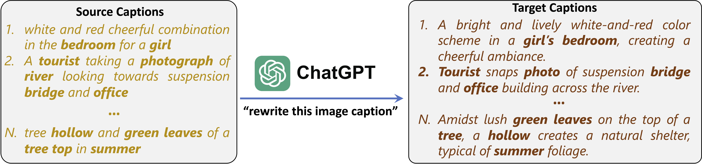
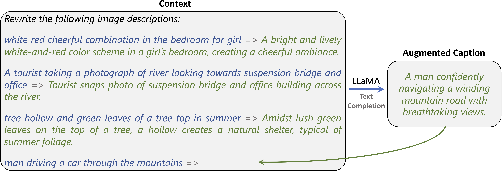

# Improving CLIP Training with Language Rewrites
This repo contains text data, code and pre-trained models for paper [Improving CLIP Training with Language Rewrites](https://arxiv.org/abs/2305.20088). 

## Overview: 
We propose Language augmented CLIP (LaCLIP). LaCLIP enhances CLIP training by rewriting text descriptions associated with each image through the in-context learning capability of large language models. 
It preserves key concepts while introducing diversity in sentence structure and vocabulary. 
During training, LaCLIP randomly selects either the original texts or the rewritten versions as text augmentations. 
Experimental results on various datasets demonstrate that LaCLIP significantly improves transfer performance without additional computational or memory requirements.
Key steps:

- **Meta-Input-Output Generation:**
we explored different strategies for generating meta-input-output pairs that can be used as examples in the prompt context for LLaMA in-context learning, namely *ChatGPT, Bard, MSCOCO* and *Human*.
Examples of generating such pairs with ChatGPT:
<p align="center"></p>

- **In-Context Learning with LLaMA:**
Utilizing the constructed context input as a prompt, LLaMA exhibits its ability to perform text completion and generate rewritten versions of the corresponding text samples. This process is conducted for each text sample present in the pre-training image-text dataset.
Example of LLaMA rewriting a text sample:
<p align="center"></p>

- **LaCLIP: Training with Rewritten Texts:**
Having generated M different rewrites for each caption, we randomly select one of them as the augmented text for each image. We then train CLIP with the augmented image-text pairs. 

## Code Overview
- 4 versions of augmented text on 3 datasets (CC3M, CC12M, RedCaps)
- Pre-trained models with LaCLIP and vanilla CLIP
- Zero-shot evaluation code on ImageNet
#### Dependencies
- PyTorch 1.11.0
- torchvision 0.12.0
- timm 0.5.4
- [open_clip](https://github.com/mlfoundations/open_clip/tree/main) (optional, for LAION-400M models)


## Augmented Texts
- **Original** is the original caption associated with each image.
- **ChatGPT/Bard/MSCOCO/Human** is the text generated by LLaMA ICL with the ChatGPT/Bard/MSCOCO/Human Meta-Input-Output pairs as in-context learning examples.

<table><tbody>
<!-- START TABLE -->
<!-- TABLE HEADER -->
<th valign="center">Dataset</th>
<th valign="center">Original</th>
<th valign="center">ChatGPT</th>
<th valign="center">Bard</th>
<th valign="center">MSCOCO</th>
<th valign="center">Human</th>

<!-- TABLE BODY -->
<tr>
<td align="center">CC3M</td>
<td align="center"><a href="https://www.dropbox.com/s/wajxrpfotcgkt7s/cc3m_original.csv?dl=0">Link</a></td>
<td align="center"><a href="https://www.dropbox.com/s/6x26v34g2iuoiss/cc3m_chatgpt.txt?dl=0">Link</a></td>
<td align="center"><a href="https://www.dropbox.com/s/u6o9mv7ukpo7epv/cc3m_bard.txt?dl=0">Link</a></td>
<td align="center"><a href="https://www.dropbox.com/s/upf6e3usak3ubnn/cc3m_mscoco.txt?dl=0">Link</a></td>
<td align="center"><a href="https://www.dropbox.com/s/6csrd83yb6tz2va/cc3m_human.txt?dl=0">Link</a></td>
</tr>
<tr>
<td align="center">CC12M</td>
<td align="center"><a href="https://www.dropbox.com/s/hndkbf5kxd2m0wi/cc12m_original.csv?dl=0">Link</a></td>
<td align="center"><a href="https://www.dropbox.com/s/znofj6j374mfvz9/cc12m_chatgpt.txt?dl=0">Link</a></td>
<td align="center"><a href="https://www.dropbox.com/s/kbv9z30s2glcaos/cc12m_bard.txt?dl=0">Link</a></td>
<td align="center"><a href="https://www.dropbox.com/s/ilfwnd46pt7doz8/cc12m_mscoco.txt?dl=0">Link</a></td>
<td align="center"><a href="https://www.dropbox.com/s/d4wue2loku20l3a/cc12m_human.txt?dl=0">Link</a></td>
</tr>
<tr>
<td align="center">RedCaps</td>
<td align="center"><a href="https://www.dropbox.com/s/viovukgvyc9uodv/redcaps_original.txt?dl=0">Link</a></td>
<td align="center"><a href="https://www.dropbox.com/s/x1by6mkffndg2ru/redcaps_chatgpt.txt?dl=0">Link</a></td>
<td align="center"><a href="https://www.dropbox.com/s/upaq5dw5xszl2fw/redcaps_bard.txt?dl=0">Link</a></td>
<td align="center"><a href="https://www.dropbox.com/s/xr9m8h8bwg9cn66/redcaps_mscoco.txt?dl=0">Link</a></td>
<td align="center"><a href="https://www.dropbox.com/s/94obx9y2d3w72u3/redcaps_human.txt?dl=0">Link</a></td>
</tr>
</tbody></table>


## Pre-trained Models
<table><tbody>
<!-- START TABLE -->
<!-- TABLE HEADER -->
<th valign="center">Dataset</th>
<th valign="center">Method</th>
<th valign="center">Zero-Shot</th>
<th valign="center">Checkpoint</th>

<!-- TABLE BODY -->
<tr>
<td align="center">CC3M</td>
<td align="center">CLIP</td>
<td align="center">15.8</td>
<td align="center"><a href="https://www.dropbox.com/s/5jsthdm85r2nfpz/cc3m_clip.pt?dl=0">ViT-B/16</a></td>
</tr>
<tr>
<td align="center">CC3M</td>
<td align="center">LaCLIP</td>
<td align="center">21.5</td>
<td align="center"><a href="https://www.dropbox.com/s/k2e1tgsfmo0afme/cc3m_laclip.pt?dl=0">ViT-B/16</a></td>
</tr>
<tr>
<td align="center">CC12M</td>
<td align="center">CLIP</td>
<td align="center">40.2</td>
<td align="center"><a href="https://www.dropbox.com/s/wwfq3txw4tk1yzj/cc12m_clip.pt?dl=0">ViT-B/16</a></td>
</tr>
<tr>
<td align="center">CC12M</td>
<td align="center">LaCLIP</td>
<td align="center">48.4</td>
<td align="center"><a href="https://www.dropbox.com/s/lle8x0tdxssfz11/cc12m_laclip.pt?dl=0">ViT-B/16</a></td>
</tr>
<tr>
<td align="center">RedCaps</td>
<td align="center">CLIP</td>
<td align="center">42.9</td>
<td align="center"><a href="https://www.dropbox.com/s/qvrvkwsy6j26suv/redcaps_clip.pt?dl=0">ViT-B/16</a></td>
</tr>
<tr>
<td align="center">RedCaps</td>
<td align="center">LaCLIP</td>
<td align="center">46.2</td>
<td align="center"><a href="https://www.dropbox.com/s/wpedkikz46gfzmg/redcaps_laclip.pt?dl=0">ViT-B/16</a></td>
</tr>
<tr>
<td align="center">LAION-400M</td>
<td align="center">CLIP</td>
<td align="center">62.0</td>
<td align="center"><a href="https://www.dropbox.com/s/zskxrso4pc4pe3j/laion400m_clip.pt?dl=0">ViT-B/32</a></td>
</tr>
<tr>
<td align="center">LAION-400M</td>
<td align="center">LaCLIP</td>
<td align="center">64.4</td>
<td align="center"><a href="https://www.dropbox.com/s/ahj8ys8uufndy9y/laion400m_laclip.pt?dl=0">ViT-B/32</a></td>
</tr>
</tbody></table>

## Zero-shot Evaluation on ImageNet
To perform zero-shot evaluation on ImageNet, use the following command:

For CC3M, CC12M and RedCaps models:
```
python eval_zeroshot_imagenet.py --imagenet-root [PATH_TO_IMAGENET] --ckpt-path [PATH_TO_CHECKPOINT] --model CLIP_VITB16 --batch-size 128 --workers 8
```
For LAION-400M models:
```
python eval_zeroshot_imagenet_laion.py --imagenet-root [PATH_TO_IMAGENET] --ckpt-path [PATH_TO_CHECKPOINT] --model ViT-B-32 --batch-size 128 --workers 8
```

## Citation
```bib
@article{fan2023improving,
  title={Improving CLIP Training with Language Rewrites},
  author={Fan, Lijie and Krishnan, Dilip and Isola, Phillip and Katabi, Dina and Tian, Yonglong},
  journal={arXiv preprint arXiv:2305.20088},
  year={2023}
}
```
